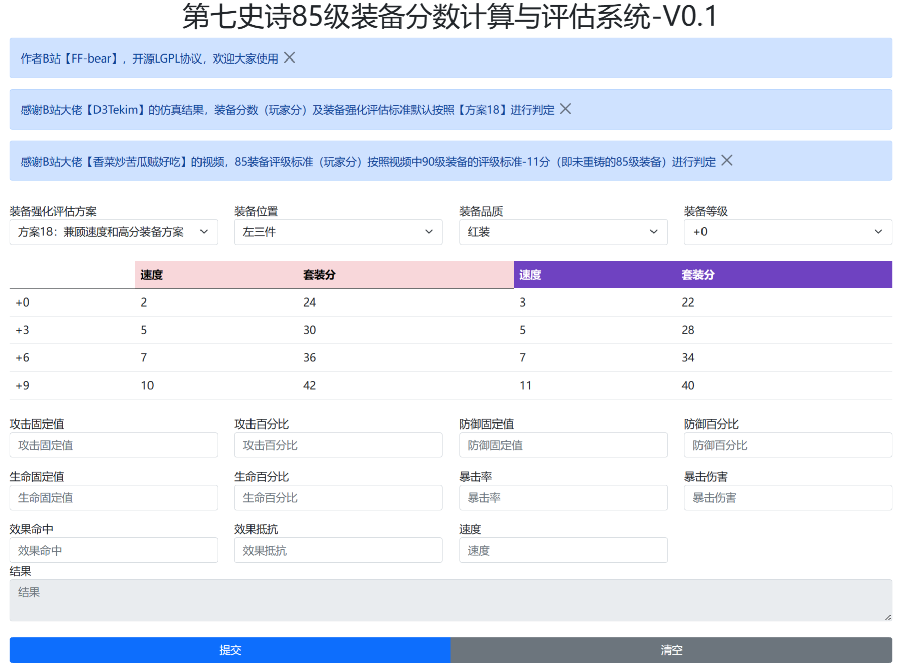

# epic7-gear-score

#### V0.1
- 可以根据B站大佬【D3Tekim】的仿真结果，按照方案11-方案21的策略进行装备的强化筛选
- 可以根据B站大佬【香菜炒苦瓜贼好吃】的经验（简略实现），对85级的红/紫装备进行评级
- 可以除了上述方案之外自定义方案（选择任意一个方案，然后更改表格中的数值，就可以自动同步到自定义方案中，可惜目前无法保存，刷新网页后就没了）
- 适配手机和电脑网页环境
- 目前只能完成左三件的装备评估

#### 未来工作
- 待续
